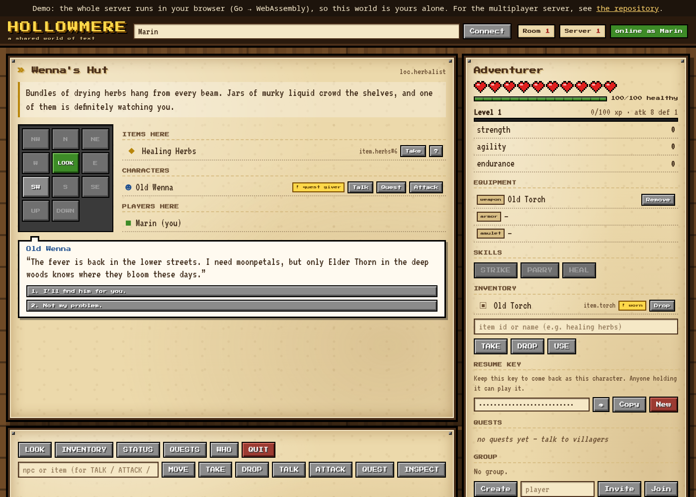
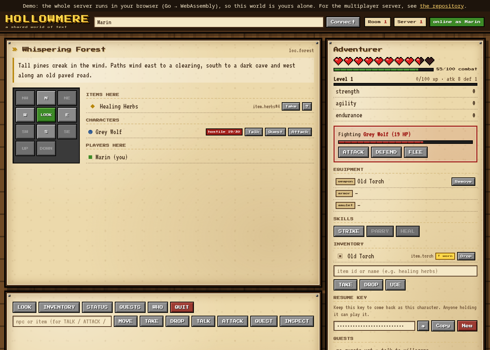

# Hollowmere

[](https://github.com/Destynyle/hollowmere/actions/workflows/ci.yml)

A shared world of text you can actually play: a multiplayer text adventure
(MUD) speaking RFC 42TAP, with a browser client over WebSocket and the raw
TCP transport kept for terminal players.

**▶ [Play the demo in your browser](https://destynyle.github.io/hollowmere/)**
— the whole Go server is compiled to WebAssembly and runs in the page, so
the demo needs no backend (your world is private, your character is kept in
the browser). The real multiplayer server starts with `docker compose up`.

This is the production version of the 42 school project *The Answer
Protocol*, rebuilt to run as a real service. The school repository stays as
it was submitted; this one is free of its constraints (Go 1.27, third-party
libraries, persistence, deployment).

| Branching dialogue | Turn-based combat |
|---|---|
|  |  |

## Highlights

- **One engine, three transports.** The game core knows nothing about
  sockets. WebSocket (browser), raw TCP (terminal client, netcat) and an
  in-page bridge (the WebAssembly demo) all plug into the same session layer:
  same rate limiting, same ordering guarantees, same cleanup.
- **A world in data.** 50 rooms in 7 zone files, 38 NPCs, 14 quests:
  branching dialogue with conditions and remembered choices, multi-step
  quest chains, conditional rewards. A validator rejects broken references
  and warns about unreachable content; CI keeps the shipped world at zero
  warnings.
- **An RPG underneath.** Levels and experience, trained statistics, three
  equipment slots, skills with cooldowns, a group dungeon whose boss scales
  with the party.
- **Playing together.** Groups, private messages, friends with presence,
  a leaderboard (in game and at `/top`), and item trading with double
  confirmation executed atomically, so nothing is ever lost or duplicated.
- **Built to be hosted.** No accounts: a 128-bit resume key brings a
  character back. SQLite with versioned migrations, hot backups and a
  verified restore, moderation (roles, mutes, key + IP bans, audit log),
  Prometheus metrics, a Grafana dashboard, a hardened systemd unit and a
  Cloudflare tunnel profile. Secrets never reach the logs.
- **Tested.** Unit and end-to-end tests with the race detector, including
  WebSocket sessions, save migrations and a scripted trade between two
  players.

## Quick start

Requirements: Go 1.27 (the Makefile picks up `~/sdk/go1.27.1` automatically)
or Docker.

```sh
make build
make run                 # web client on http://127.0.0.1:8080, TCP on 4243
make run-client NAME=me  # the terminal client, on the same server
```

With Docker:

```sh
docker compose up -d --build
docker compose logs -f
```

The browser demo, locally:

```sh
make demo-serve          # builds site/ (Go -> WebAssembly), serves http://127.0.0.1:8000
```

## How it is put together

| Package | Role |
|---------|------|
| `internal/proto` | RFC 42TAP wire format: line framing, command parsing, error codes |
| `internal/game` | The world and every command; no network code, talks to players through a `Sink` |
| `internal/session` | Transport-independent session: admission, rate limiting, bounded output queue, cleanup |
| `internal/tcpd` | Raw TCP transport (CLI client, netcat) |
| `internal/webd` | Web client, WebSocket endpoint, `/healthz`, `/metrics` |
| `internal/web` | The browser client, embedded in the binary |
| `internal/logs` | Non-blocking JSON logging on top of `log/slog` |
| `internal/limit` | Token bucket shared by the session flood control and private messages |
| `internal/store` | SQLite persistence: characters, leaderboard, moderation, migrations |
| `cmd/hollowmere`, `cmd/tapcli` | the server, and the terminal client |
| `cmd/demo`, `web-demo/` | the server compiled to WebAssembly, and the page bridge |
| `data/world/` | the world, one JSON file per zone |

A transport only implements `session.Conn` (read a line, write a line,
close). The TCP and WebSocket front-ends therefore share the same abuse
detection, the same ordering guarantees, and the same disconnect handling.

The browser talks WebSocket: one text message per protocol line, in order.
No local bridge any more — the server serves the client and the socket from
the same origin.

## Configuration

Flags, or the matching environment variables (handy in Docker):

| Flag | Env | Default | Meaning |
|------|-----|---------|---------|
| `-http` | `TAP_HTTP` | `0.0.0.0:8080` | web client, WebSocket, health and metrics |
| `-tcp` | `TAP_TCP` | `0.0.0.0:4243` | raw TCP transport (empty string disables it) |
| `-world` | `TAP_WORLD` | `data/world` | world directory (one file per zone), or a single world file |
| `-log-file` | `TAP_LOG_FILE` | — | append JSON logs to this file as well |
| `-log-level` | `TAP_LOG_LEVEL` | `info` | `debug` logs every command and reply |
| `-origins` | `TAP_ORIGINS` | same-origin only | hosts allowed to open a WebSocket |
| `-trust-proxy` | `TAP_TRUST_PROXY=1` | off | read the client IP from `CF-Connecting-IP` / `X-Forwarded-For` |
| `-metrics-token` | `TAP_METRICS_TOKEN` | — | require this token on `/metrics` (Bearer header or `?token=`) |
| `-db` | `TAP_DB` | `state/hollowmere.db` | character database; `none` disables persistence |
| `-autosave` | — | `60s` | how often connected characters are saved |
| `-backup <path>` | — | — | copy the database and exit (for cron) |
| `-check` | — | — | validate the world, print warnings and exit |
| `-metrics-token-file` | `TAP_METRICS_TOKEN_FILE` | — | read the `/metrics` token from a file (shared with Prometheus) |
| `-grant NAME:ROLE` | — | — | make a character `moderator` or `admin` (`none` removes), then exit |
| `-admins`, `-sanctions` | — | — | list roles, or bans and mutes in force, then exit |
| `-unban NAME` | — | — | lift a character's bans and exit |
| `-verify-db` | — | — | check the database integrity and exit |

## The world

The world lives in `data/world/`, one JSON file per zone (`village`,
`crypt`, `forest`, `mines`, `marsh`, `hill`), merged at load time. Each file
may hold `rooms`, `items`, `npcs` and `quests`; exits, spawns and quests
freely reference ids from other zones. An id may be defined only once, and
the header (`name`, `start_room`, `safe_room`, `settings`) sits in
`_world.json`. `-world` also accepts a single file with everything in it.

`make check-world` (part of `make lint`) rejects broken references and
unreachable rooms, and warns about likely mistakes: one-way exits, rooms
without exits, NPCs without a role or never placed, items nobody can obtain,
quests nobody can finish, prerequisite loops, and dialogue nodes nobody can
reach. The shipped world has no warnings, and a test keeps it that way.

**Dialogue trees.** An NPC keeps its simple `dialogue` list (cycled by
`TALK`) or gets a `dialogue_tree`: nodes with a `text` and `options`. Each
option leads to a `next` node (`""` ends the conversation), may be hidden
behind an `if` condition, may `set_flag` to remember the choice, and may
carry a `quest` to accept or hand in. A node without options ends the
conversation.

```json
"dialogue_tree": {
  "start": {
    "text": "Ah, a new face.",
    "options": [
      { "text": "You look worried.", "next": "worried", "if": { "quest": "q.moonpetal", "status": "none" } },
      { "text": "Goodbye.", "next": "" }
    ]
  },
  "worried": {
    "text": "The fever is back...",
    "options": [{ "text": "I'll help.", "next": "", "quest": "q.moonpetal" }]
  }
}
```

A condition combines any of: `quest` + `status` (`none`, `available`,
`active`, `ready`, `completed`, `not_completed`), `flag`, `no_flag`, `item`
(carried). Options carrying a quest only show while that quest can be
accepted or is under way.

**Quest chains.** A simple quest has one objective (`type`, `target`,
`count`). A chain lists `steps` instead, each with a `description`, a `type`
(`fetch`, `deliver`, `kill`, `visit`, `talk`), a `target` (item, NPC or
room) and a `count`. Every step but the last completes on its own; the last
is handed in to the `turn_in` NPC. `requires` lists prerequisite quests, and
`reward.bonus` grants extra items or health only when its `if` condition
holds at completion — for instance a flag set by a dialogue choice.

## Progression

- **Experience.** Defeating an enemy gives its `xp` (by default
  `hp/2 + 2×attack + 2×defense`) to every player who hurt it; a quest gives
  its `reward.xp` (by default 50 per step). Level *n* needs
  `100 × n^1.5` more points. A new level brings +10 max HP, +1 attack every
  second level, a full heal and 2 stat points (`EVT PLAYER LEVEL <n>`).
- **Statistics**, raised with `TRAIN <stat>`: strength (+1 attack),
  agility (+1 speed, +2% critical chance), endurance (+5 max HP).
- **Equipment.** Three slots: weapon, armor, amulet. Only worn items count
  in combat. `EQUIP <item>` / `UNEQUIP <slot>`; items may need a
  `min_level`. A new item goes on by itself when its slot is empty
  (`EVT PLAYER EQUIP <slot> <item>`). In the world files, `slot` is
  guessed from `attack` (weapon) or `defense` (armor) unless set.
- **Skills**, listed by `SKILLS` and used with `SKILL <name>`:
  `strike` (level 1, double damage, cooldown 3), `parry` (level 2, blocks
  the next blow and ripostes, cooldown 4), `heal` (level 3, 20 + 5 per level
  HP, cooldown 5). Cooldowns count combat rounds; out of combat one round
  also passes every 6 seconds.
- **Saves** are version 2. A version 1 character comes back with the
  experience of the quests it had completed, and wears the best items it
  carries.

## Playing together

- **Private messages**: `TELL <player> <message>` reaches a connected
  player anywhere as `EVT PRIVATE MESSAGE <from> <message>`. On top of the
  session limits, each player may send a burst of 5 then one every 2 s.
- **Friends**: `FRIEND ADD|REMOVE <name>`, `FRIEND LIST`. The list is saved
  with the character, and friends get `EVT FRIEND ONLINE|OFFLINE <name>`.
- **Leaderboard**: `TOP` in game, `/top` on the web (read-only page) and
  `/top.json`. Ranked by level, experience, quests completed, enemies
  defeated; connected players show their live figures.
- **Trading**: `TRADE <player>` asks, the same command from the other side
  opens it; then `TRADE OFFER|REMOVE <item>`, `TRADE ACCEPT`, `TRADE CANCEL`,
  `TRADE INFO` (`TRADE WITH <player>` if a name looks like a subcommand).
  Both must accept, any change withdraws both acceptances, and the swap is
  one operation under the world lock after checking that every item is
  still held. Moving or logging out cancels the trade.
- **Group dungeon**: below the Forge of the Deep, the Round Gate
  (`min_group: 2`) only opens to a group with at least two members at the
  door or already inside (`ERR 419 GROUP_REQUIRED`). Its enemies use
  `scale_per_player`: when a fight starts, their health grows by that
  percentage for each extra player in the room.

## Protocol extensions

Hollowmere speaks RFC 42TAP; clients that only know the RFC keep working.
The additions:

| Addition | Form |
|----------|------|
| Resume key | `CONNECT <name> [key]`, `EVT PLAYER KEY <key>` |
| Conversation | `TALK <npc>` reply may carry `"options":[{"n":1,"text":"…"}]`; `SAY <n>` picks one and answers in the same shape, plus `"quest"` when the option accepted or handed in a quest. No options: the conversation is over. |
| Quest steps | quest replies carry `step`, `steps` and `objective`; `EVT QUEST STEP <quest> <i>/<n>` when a new step begins |
| Progression | `EQUIP <item>`, `UNEQUIP <slot>`, `TRAIN <stat>`, `SKILL <name>`, `SKILLS`; `STATUS` adds `level`, `xp`, `xp_next`, `stats`, `points`, `speed`, `critical_chance`, `equipment`; `INSPECT` adds `slot`, `min_level`, `equipped`; quest replies add `xp` |
| Progression events | `EVT PLAYER XP <gained> <xp>/<next>`, `EVT PLAYER LEVEL <n>`, `EVT PLAYER EQUIP <slot> <item>` |
| Social | `TELL <player> <msg>`, `FRIEND ADD\|REMOVE\|LIST`, `TOP`, `TRADE <player>\|OFFER\|REMOVE\|ACCEPT\|CANCEL\|INFO\|WITH` |
| Social events | `EVT PRIVATE MESSAGE <from> <msg>`, `EVT FRIEND ONLINE\|OFFLINE <name>`, `EVT TRADE REQUEST\|OPEN\|CANCEL <player>`, `EVT TRADE UPDATE\|DONE <json>` |
| Moderation | `ANNOUNCE`, `KICK`, `MUTE`, `UNMUTE`, `BAN`, `UNBAN`; events `EVT SERVER ANNOUNCE <msg>`, `EVT SERVER KICK\|BAN <why>`, `EVT SERVER MUTE <duration> <why>` |
| Errors | `410 NOT_IN_CONVERSATION` (`SAY` with no open conversation, or the NPC left), `411 INVALID_CHOICE`, `412 LEVEL_TOO_LOW`, `413 NOT_EQUIPPABLE`, `414 SKILL_NOT_READY`, `415 NO_STAT_POINTS`, `416 TOO_MANY_FRIENDS`, `417 NOT_TRADING`, `418 TRADE_BUSY`, `419 GROUP_REQUIRED`, `420 MUTED`, `403 FORBIDDEN`, `904 BANNED`, `404 SLOT_EMPTY`, `404 SKILL_NOT_FOUND` |

Moving to another room closes the conversation. In the terminal client, type
the number of an answer (or `answer <n>`).

## Characters, without accounts

There is no sign-up, no password and no e-mail. On the first visit the
server creates a character and sends its **resume key** — 128 random bits —
to that client only:

```text
C: CONNECT marin
S: OK connected
S: EVT PLAYER KEY jv4c2hq7t3m6k9x1b8n5r0wzye
```

The client stores the key (browser local storage, or
`~/.config/hollowmere/keys.json` for the CLI) and sends it next time:

```text
C: CONNECT marin jv4c2hq7t3m6k9x1b8n5r0wzye
S: OK connected          ← same room, health, inventory and quests
```

- The key is the character's only secret: whoever holds it plays it. The web
  client keeps it masked, with **Copy** to save it elsewhere and **New** to
  forget it and start over.
- A name belongs to the key that created it, so nobody else can take it.
- An unknown key is not an error: it simply starts a new character.
- Characters are saved on disconnect, every 60 s, and on shutdown.
- Clients from other groups send `CONNECT <name>` alone and get a fresh
  character each time; the extra argument is a v2 extension.

**What happens to carried items.** World items (herbs, potions, torches) go
back to the room they came from, so the world stays playable for everyone
else. Quest rewards and loot travel with the character and are recreated on
its return — which also frees the loot slot of the enemy that dropped it.
Nothing is duplicated.

**Backups.** `deploy/backup.sh` runs `hollowmere -backup`, which uses
SQLite's `VACUUM INTO`: a consistent copy while players keep playing. It
compresses the copy and keeps two weeks of history. The database lives in
`state/` (the Docker volume), together with the logs.

## Endpoints

| Path | Purpose |
|------|---------|
| `/` | the browser client |
| `/ws` | one WebSocket per player, carrying protocol lines |
| `/healthz` | JSON: status, players, connections, uptime |
| `/metrics` | Prometheus text (token as `Authorization: Bearer` or `?token=`): players, connections, commands, errors, abuse counters |
| `/top`, `/top.json` | the leaderboard, read-only |

## Moderation

Moderators (`ANNOUNCE`, `KICK`, `MUTE`, `UNMUTE`) and admins (also `BAN`,
`UNBAN`) are granted from the console with `-grant`. A ban covers the
resume key and the IP address (the IP part for 7 days at most); a mute
blocks `CHAT` and `TELL` for a set time. Every action is logged and kept
in the `modlog` table. Details in `deploy/README.md`.

## Operations

Production setup (tunnel, backups, restore, supervision, checklist):
**`deploy/README.md`**.


- **Logs** are JSON lines on stdout (and `TAP_LOG_FILE`), written by a
  background goroutine that drops records rather than slowing the game.
  `tail -f state/server.log | jq -c 'select(.level != "INFO")'`
- **Limits**: 10 commands/s per connection (burst 40) then a kick, 20
  connections per IP per 10 s, 16 at once per IP, 512 connections, 1024
  bytes per line.
- **Secrets in logs**: resume keys never appear, at any level.
- **Shutdown**: `SIGTERM` announces the restart to players (`EVT SERVER …`),
  drains the write queues, then exits. Browser clients reconnect on their
  own with a growing delay.

## Roadmap

1. ~~Socle: engine ported, Docker, tests~~
2. ~~Transport: WebSocket + web client served by the server, TCP kept~~
3. ~~Persistence: SQLite, resume key, periodic save~~
4. ~~Content: bigger world, extended format, dialogue choices, quest chains~~
5. ~~Progression: XP, levels, stats, worn equipment, skills~~
6. ~~Social: private messages, friends, leaderboard, trading, group dungeons~~
7. ~~Production: moderation, backups, Cloudflare tunnel, supervision~~

## Credits

Built by dsom and dlaktaf, from their 42 project. Protocol: RFC 42TAP.
